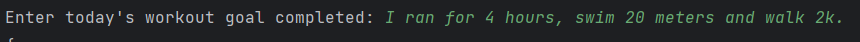

WORKOUT TRACKING APP.

Basic application in which you can enter your workout completed status in normal english, for example:

It will be updated in your google sheets.

Used API post request with python language.

**Pre-requisite:**

Setup these environment variables
    
url : nutritionix.com

See API documentation to setup

    APP_ID,
    API_KEY

url : sheety.co

See API documentation to setup Basic authentication.

    AUTHENTICATION_KEY